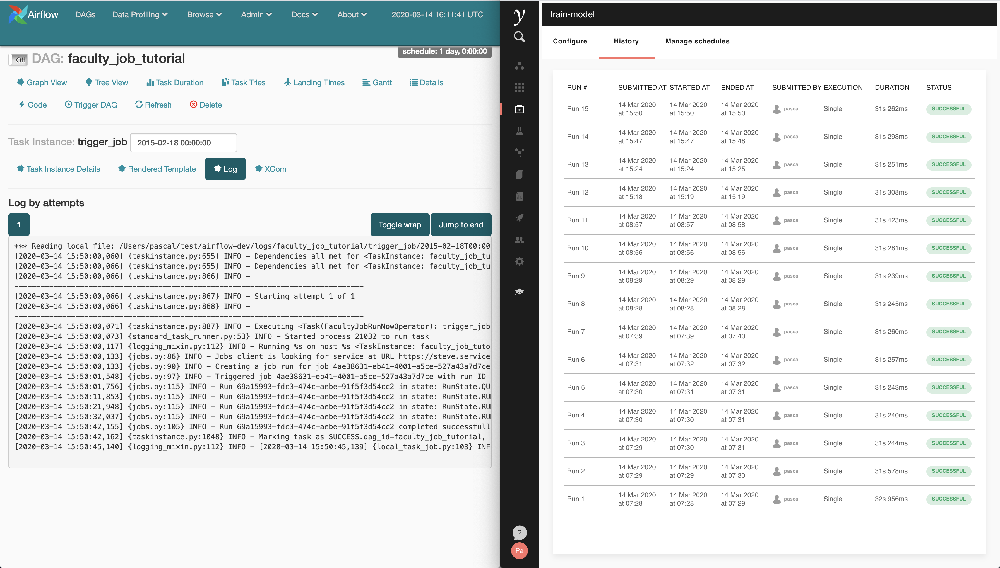

# Airflow Faculty Plugin

The *Airflow Faculty Plugin* lets you interact with Faculty services
from [Apache Airflow](https://airflow.apache.org/). Currently, the
only supported mode of interaction is triggering jobs.

## Installation

You can install this plugin from PyPI into the Python environment that
executes the DAG:

```
pip install airflow-faculty-plugin
```



## Operators

### FacultyJobRunNowOperator

This operator triggers a Faculty job run and waits for an end event
for the job run (such as COMPLETED or ERROR).

Use this operator in your DAG as follows:

```py
from airflow import DAG

from airflow.operators.faculty import FacultyJobRunNowOperator

dag = DAG("faculty_job_tutorial")

run_job = FacultyJobRunNowOperator(
    job_id="260938d9-1ed8-47eb-aaf2-a0f9d8830e3a",
    project_id="e88728f6-c197-4f01-bdf2-df3fc92bfe4d",
    polling_period_seconds=10,
    task_id="trigger_job",
    dag=dag
)
```

The operator accepts the following parameters:

- `job_id`: the ID of the job to trigger. To find the ID, run
   `faculty job list -v` in the project that this job is in.
- `project_id`: the ID of the job to trigger. To find the ID,
   run `echo $FACULTY_PROJECT_ID` in the terminal of a server
   in this project.
- `polling_period_seconds`: The number of seconds between checks for
   whether the job has completed. Use a low number if you expect
   the job to finish quickly, and a high number if the job is
   longer. Defaults to 30s.
- `job_parameter_values`: a dictionary mapping parameter names
   to the values they should take in this run. For instance,
   if the job requires the parameter `NUMBER_ESTIMATORS`, pass in:
   `{"NUMBER_ESTIMATORS": "50"}`
- `client_configuration`: customise how to connect and authenticate
   with the Faculty API.

### Authenticating with Faculty

To authenticate with Faculty, users can either:

- pass connection parameters via the file
  `~/.config/faculty/credentials` or the environment variables
  `FACULTY_CLIENT_ID`, `FACULTY_CLIENT_SECRET` and
  `FACULTY_SERVICES_DOMAIN`. These are read automatically.
- pass parameters to each task. This works well when integrated with
  Airflow
  [variables](https://airflow.apache.org/docs/stable/concepts.html#variables).
  For instance, define the `faculty_client_id` and
  `faculty_client_secret` variables via the Airflow console:

,
    client_configuration={
        "client_id": Variable.get("faculty_client_id"),
        "client_secret": Variable.get("faculty_client_secret"),
        "domain": "services.cloud.my.faculty.ai",
    },
    dag=dag
)
```

Here, `domain` should be `services.URL`, where `URL` is the base URL
of your Faculty deployment.

Thus, for instance, if the URL of your Faculty deployment is
`cloud.my.faculty.ai`, the value of `domain` should be
`services.cloud.my.faculty.ai`.
